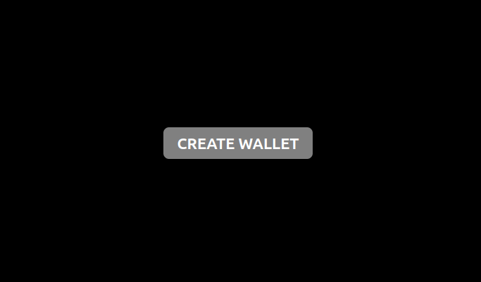
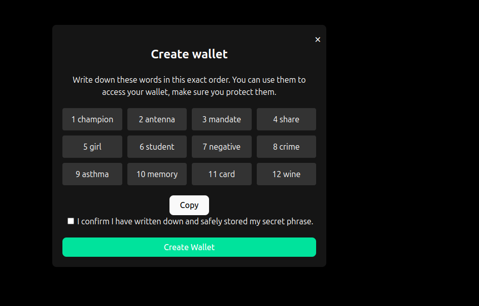
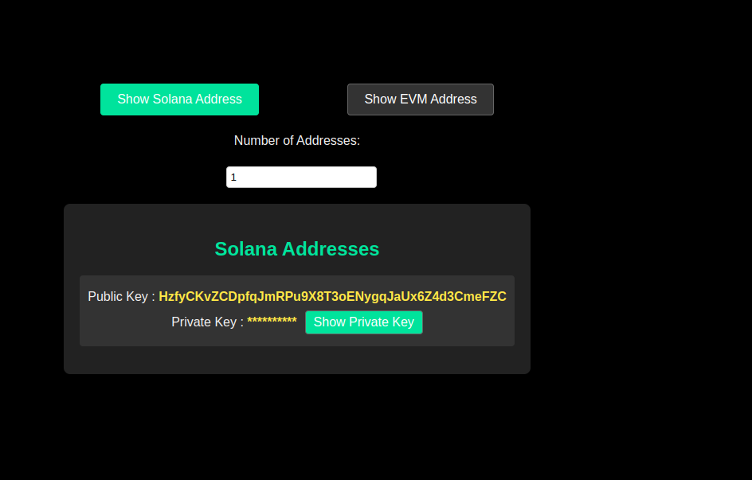

# Crypto Wallet Web Application

This project is a simple web application that allows users to create their own cryptocurrency wallets. The app is built using Vite, React, and TypeScript.

## Features

- **Create Wallet:** Users can generate their own crypto wallet by clicking on the "Create Wallet" button.
- **Mnemonic Phrase:** Upon wallet creation, a 12-word mnemonic phrase is displayed. Users are instructed to write it down securely as it is required for accessing the wallet.
- **Address Generation:** The app allows users to generate and display their Solana and EVM addresses.
- **Private Key:** Users can view their private key by clicking the "Show Private Key" button. This is initially hidden for security purposes.

## Tech Stack

- **Frontend Framework:** React
- **Build Tool:** Vite
- **Language:** TypeScript
- **UI/Styling:** Custom CSS

## Getting Started

### Prerequisites

- Node.js installed on your local machine.
- Yarn or npm as a package manager.

### Installation

1. Clone the repository:
    ```bash
    git clone https://github.com/iamnas/webwallet.git
    cd webwallet
    ```

2. Install dependencies:
    ```bash
    yarn install
    # or
    npm install
    ```

3. Start the development server:
    ```bash
    yarn dev
    # or
    npm run dev
    ```

4. Open your browser and navigate to `http://localhost:5173` to see the app in action.

### Deployment

This app is currently deployed on Vercel. You can access it via the following URL:

[Crypto Wallet App](https://webwallet-chi.vercel.app/)

### Screenshots

- **Demo GIF**: A quick demo of the app in action.

  

- **Initial Screen**: User can create a wallet by clicking on the "Create Wallet" button.

  

- **Mnemonic Phrase Screen**: Displays a 12-word mnemonic phrase that the user must write down and store securely.

  

- **Address Display Screen**: Shows the generated Solana or EVM address along with an option to reveal the private key.

  

### License

This project is licensed under the MIT License. See the `LICENSE` file for more details.

### Acknowledgments

- This project was bootstrapped with [Vite](https://vitejs.dev/).
- Special thanks to all the contributors of the various libraries used in this project.

